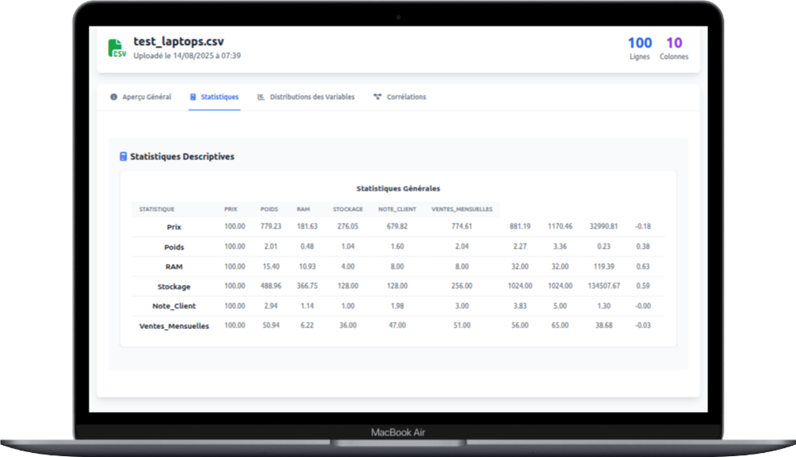

# 🚀 Vizaur-EDA-Tool

**Un outil d'analyse exploratoire de données (EDA) moderne et intuitif, développé avec Django et Python.**

[](https://www.python.org/downloads/)
[](https://www.djangoproject.com/)
[](LICENSE)

## 📊 **Vue d'ensemble**

Vizaur-EDA-Tool est une application web moderne qui simplifie l'analyse exploratoire de données. Conçu pour les data scientists, analystes et chercheurs, il offre une interface intuitive pour analyser rapidement vos datasets et découvrir des insights cachés.

### ✨ **Fonctionnalités principales**

- 📁 **Upload simple** : Support CSV, XLS, XLSX
- 🔍 **Analyse automatique** : Détection intelligente des types de variables
- 📈 **Visualisations interactives** : Histogrammes, graphiques en barres, corrélations
- 📊 **Statistiques complètes** : Statistiques descriptives détaillées
- 🎯 **Interface moderne** : Design responsive avec Tailwind CSS
- ⚡ **Performance optimisée** : Chargement AJAX pour une expérience fluide

## 🖼️ **Captures d'écran**

### **Page d'accueil**


### **Upload de dataset**


### **Aperçu général**


## 🛠️ **Technologies utilisées**

### **Backend**
- **Django 5.2.4** - Framework web Python
- **Pandas** - Manipulation et analyse de données
- **NumPy** - Calculs numériques
- **Matplotlib/Seaborn** - Génération de graphiques
- **Scikit-learn** - Analyses statistiques avancées

### **Frontend**
- **HTML5/CSS3** - Structure et style
- **Tailwind CSS** - Framework CSS utilitaire
- **JavaScript (ES6+)** - Interactivité et AJAX
- **Font Awesome** - Icônes

### **Base de données**
- **SQLite3** - Base de données légère (production : PostgreSQL recommandé)

## 🚀 **Installation rapide**

### **Prérequis**
- Python 3.8 ou supérieur
- pip (gestionnaire de paquets Python)

### **Méthode 1 : Installation automatisée (Recommandée)**

#### **Linux/Mac**
```bash
git clone https://github.com/ThePerformer0/Vizaur-EDA-Tool.git
cd Vizaur-EDA-Tool
./install.sh
```

#### **Windows**
```cmd
git clone https://github.com/ThePerformer0/Vizaur-EDA-Tool.git
cd Vizaur-EDA-Tool
install.bat
```

#### **Toutes plateformes (Python)**
```bash
git clone https://github.com/ThePerformer0/Vizaur-EDA-Tool.git
cd Vizaur-EDA-Tool
python install.py
```

**Les scripts d'installation automatisés :**
- ✅ Vérifient la version Python
- ✅ Créent l'environnement virtuel
- ✅ Installent toutes les dépendances
- ✅ Configurent la base de données
- ✅ Proposent la création d'un superutilisateur
- ✅ Lancent automatiquement le serveur

### **Méthode 2 : Installation manuelle**

1. **Cloner le repository**
   ```bash
   git clone https://github.com/ThePerformer0/Vizaur-EDA-Tool.git
   cd Vizaur-EDA-Tool
   ```

2. **Créer un environnement virtuel**
   ```bash
   python -m venv venv
   source venv/bin/activate  # Linux/Mac
   # ou
   venv\Scripts\activate     # Windows
   ```

3. **Installer les dépendances**
   ```bash
   pip install -r requirements.txt
   ```

4. **Configurer la base de données**
   ```bash
   python manage.py migrate
   ```

5. **Créer un superutilisateur (optionnel)**
   ```bash
   python manage.py createsuperuser
   ```

6. **Lancer le serveur**
   ```bash
   python manage.py runserver
   ```

7. **Accéder à l'application**
   Ouvrez votre navigateur et allez sur `http://127.0.0.1:8000`

## 📖 **Guide d'utilisation**

### **1. Upload d'un dataset**
- Cliquez sur "Upload" dans la navigation
- Sélectionnez votre fichier CSV, XLS ou XLSX
- L'application analysera automatiquement votre fichier

### **2. Exploration des données**
Une fois votre dataset uploadé, vous accédez à 4 onglets d'analyse :

#### **📋 Aperçu Général**
- Résumé du dataset (lignes, colonnes, mémoire)
- Informations détaillées sur chaque colonne
- Types de variables détectés automatiquement
- Aperçu des premières et dernières lignes

#### **🧮 Statistiques**
- Statistiques descriptives complètes
- Moyenne, médiane, écart-type, quartiles
- Asymétrie et kurtosis
- Gestion des valeurs manquantes

#### **📊 Distributions des Variables**
- **Variables numériques** : Histogrammes avec courbe de densité
- **Variables catégorielles** : Graphiques en barres
- Détection automatique de la normalité
- Analyse de l'asymétrie des distributions

#### **🔗 Corrélations**
- Matrice de corrélations interactive
- Identification des corrélations significatives
- Visualisation des relations entre variables
- Seuils de corrélation configurables

### **3. Gestion des datasets**
- Liste de tous vos datasets uploadés
- Suppression sécurisée des fichiers
- Métadonnées et statuts de traitement

## 🏗️ **Architecture du projet**

```
Vizaur-EDA-Tool/
├── vizaur_project/          # Configuration Django
│   ├── settings.py          # Configuration du projet
│   ├── urls.py              # URLs principales
│   └── wsgi.py              # Point d'entrée WSGI
├── eda_app/                 # Application principale
│   ├── models.py            # Modèle Dataset
│   ├── views.py             # Contrôleurs (5 vues)
│   ├── forms.py             # Formulaire d'upload
│   ├── urls.py              # Routing de l'app
│   ├── utils/               # Utilitaires d'analyse
│   │   └── data_analyzer.py # Moteur d'analyse
│   ├── templates/           # Templates HTML
│   └── static/              # Assets (CSS/JS)
├── media/                   # Stockage des fichiers
├── install.py               # Script d'installation Python
├── install.sh               # Script d'installation Linux/Mac
├── install.bat              # Script d'installation Windows
└── requirements.txt         # Dépendances Python
```

### **Structure MVC**
- **Modèle** : `Dataset` - Gestion des métadonnées
- **Vue** : Templates HTML avec interface moderne
- **Contrôleur** : Vues Django avec logique métier


## **Limitations de fichiers**
Dans `settings.py` :

```python
# Taille maximale des fichiers (en bytes)
MAX_UPLOAD_SIZE = 50 * 1024 * 1024  # 50MB

# Types de fichiers autorisés
ALLOWED_FILE_TYPES = ['.csv', '.xls', '.xlsx']
```

## 🤝 **Contribution**

Les contributions sont les bienvenues ! Voici comment contribuer :

1. **Fork** le projet
2. **Créez** une branche pour votre fonctionnalité (`git checkout -b feature/AmazingFeature`)
3. **Commitez** vos changements (`git commit -m 'Add some AmazingFeature'`)
4. **Push** vers la branche (`git push origin feature/AmazingFeature`)
5. **Ouvrez** une Pull Request

### **Guidelines de contribution**
- Respectez les conventions PEP 8 pour Python
- Ajoutez des tests pour les nouvelles fonctionnalités
- Documentez votre code
- Mettez à jour le README si nécessaire

## 📄 **Licence**

Ce projet est sous licence MIT. Voir le fichier [LICENSE](LICENSE) pour plus de détails.

## 🙏 **Remerciements**

- **Django** - Framework web exceptionnel
- **Pandas** - Bibliothèque d'analyse de données
- **Tailwind CSS** - Framework CSS moderne
- **Font Awesome** - Icônes de qualité

---

**Développé avec ❤️ pour la communauté data science**

*Vizaur-EDA-Tool*